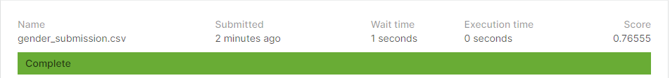

# Artificial-Intelligence-Project
## Group Members:
### Ayesha Siddiqui (63652)
### Samad Shahid (63590)
### Muhammad faique raza (63706)

## SCORE SCREENSHOT
###

## Problem Faced​
### Issue 1: 

First issue we confronted with introducing scikit-learn on the grounds that we were utilizing python2 which don't uphold scikit-adapt any longer so we have utilized python3 and make virtual envirrnment. 

### Issue 2: 

Second issue we confronted with kaggle we were transferring the code record rather than csv document because of which it was giving libraries mistake and we couldn't get yield on kaggle as were getting it directly on order brief already.Then subsequent to transferring csv document we had the option to get exactness of 0.98067. 

### Issue 3: 

Third issue was with test document which was having scale picture pixel mistake and when in the wake of fixing the blunder we trried to re transfer the record it was having the size issue because of which we transfer the compress record.
## APPROCH:
## Approches we used.
* linear regression.
* Naive Bayes.
* Libraries(scikit-learn,pandas,numpy).
## Descripition:
## Reference:
* https://github.com/AndreBiedenkapp/NaivePyes
* https://scikit-learn.org/stable/modules/naive_bayes.html
* https://www.kaggle.com/msahebi/mnist-naive-bayesian-classifier
